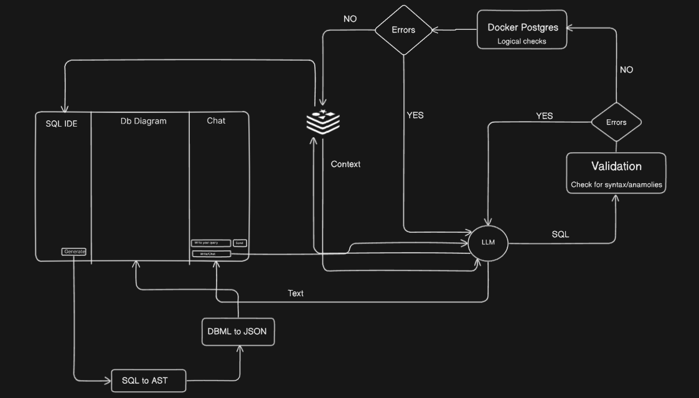

"# dbdiagram-mirror (AI-assisted)"

## Introduction

An AI-assisted prompt-to-Postgres-to-table visualization tool. This project mirrors the simplicity of dbdiagram while adding intelligent assistance to go from natural language prompts to SQL schema, generate and validate Postgres tables, and visualize the resulting database structure interactively.

## Architecture

The system comprises a Next.js client, a Node/Express server, and an LLM-assisted pipeline. The client collects a natural-language prompt and offers a live preview of generated SQL and diagrams. The server exposes REST endpoints that orchestrate the AI model to translate prompts into Postgres DDL, perform schema linting/validation, and optionally execute against a sandboxed database (or simulate) for metadata extraction. The resulting schema is returned to the client for visualization using lightweight graph components and utilities. State management keeps prompt, SQL, and diagram in sync. The design emphasizes modularity: AI adapters, schema validators, diagram renderers, and persistence are separable, enabling easy swapping and future scaling. Observability hooks and structured logging aid debugging and performance tuning, while clear interfaces allow future migration to queues or serverless workers for heavy generation tasks.

## Features

- AI prompt-to-SQL (DDL) generation for Postgres
- Schema validation and normalization utilities
- Table and relationship visualization (dbdiagram-style)
- Edit-in-place: tweak SQL and instantly re-render diagram
- Shareable schema output (copy/export)
- Minimal, fast, client-first UX with server orchestration

## Future additions

- One-click deploy to hosted sandbox Postgres for live introspection
- Reverse engineering from existing databases (introspect to schema + diagram)
- Collaboration: comments, suggestions, and version history
- Multi-dialect support (MySQL, SQLite, MSSQL) via pluggable generators
- ERD enhancements (crow’s foot, colors, grouping, notes)
- Security hardening and rate limiting for AI endpoints
- Persistent projects with auth and cloud storage
